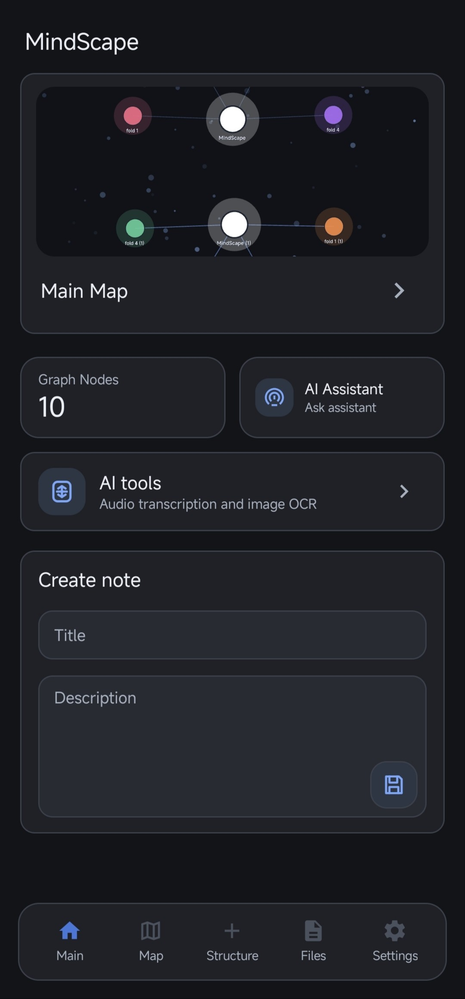
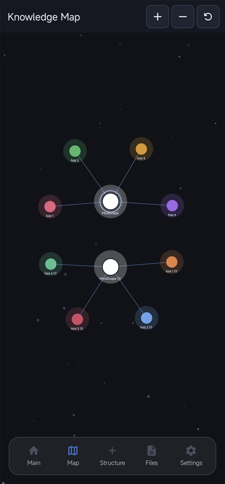
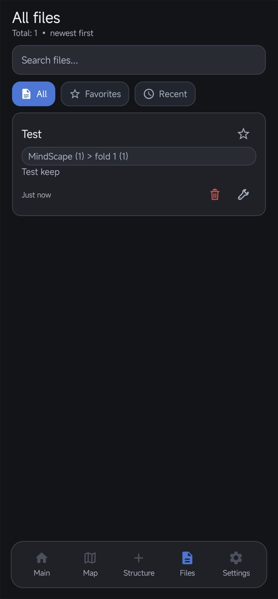
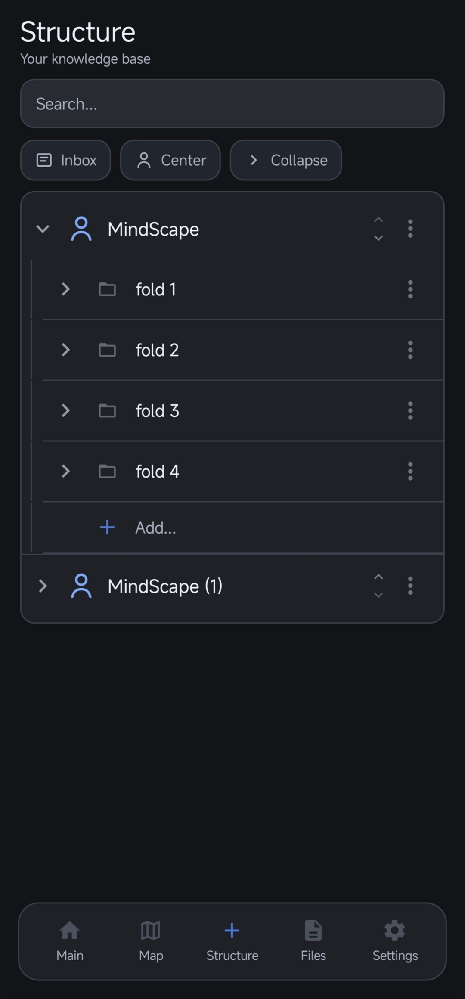

# MindScape

> [English](README.md) | **Русский**

MindScape — open-source, local-first нативное Android-приложение для создания личной визуальной базы знаний.
Создавайте связанные заметки и папки, добавляйте локальные файлы, просматривайте их на интерактивной карте, ищите по материалам и храните переносимые SQLAR-бэкапы на устройстве.

## Возможности

- Интерактивная карта знаний в persistent WebView.
- Заметки, папки, связи, локальные файлы и полнотекстовый поиск.
- Создание и восстановление SQLAR-бэкапов, включая автоматические локальные бэкапы.
- Прямое подключение к выбранному пользователем OpenAI-совместимому AI-провайдеру.
- Отдельные модели для чата, OCR и транскрибации.
- API-ключи хранятся только на устройстве в `EncryptedSharedPreferences`.
- Без отслеживающих компонентов и встроенных API-ключей.

## Приватность

MindScape работает по принципу local-first. Ваши заметки, файлы, настройки и бэкапы остаются на устройстве, если вы сами не экспортируете/не поделитесь ими или не отправите выбранные данные настроенному вами AI-провайдеру. В приложении нет отслеживающих компонентов, встроенного backend и API-ключей разработчика.

## Скриншоты






## Сборка

Требуются Android Studio или Android SDK 36 и JDK 11.

```bash
./gradlew test lintDebug assembleDebug
./gradlew installDebug
```

Ключ подписи для release хранится только локально. Не добавляйте keystore и пароли в Git.

## Лицензия

MindScape распространяется по [GNU General Public License v3.0](LICENSE).
